# チュートリアル


## 1. 概要
さくらの通信モジュール単体にはユーザー様がプログラムを書き込めるマイコン、センサーは含まれていません。別途準備していただく必要があります。
このチュートリアルでは、さくらの通信モジュールと、Arduino Unoを接続し、Arduinoからデータを送信できるところまで説明をしています。

本マニュアルでは以下の製品を利用しています。必要に応じて購入してください。

* Arduino Uno R3 https://www.switch-science.com/catalog/789/
* 3.3V USBシリアル変換ケーブル TTL-232R-3V3 http://akizukidenshi.com/catalog/g/gM-05840/
* 4.7kΩ抵抗 2本 http://akizukidenshi.com/catalog/g/gR-16472/

### チャンネルとは

さくらのIoT Platform αでは、モジュールとのデータのやりとりはチャンネルという単位で行われます。
チャンネルはチャンネルID (0から127)と、型(unsined 32bit、signed 64bit 等)と、値の組み合わせで構成されています。

モジュールの送信チャンネルに値をセットすると、閉域網を通ってプラットフォームにデータが送信され、
また、プラットフォームからチャンネルにデータを送信すると、モジュールの受信チャンネルに値がセットされます。


### プロジェクトとは

さくらのIoT Platform αでは、複数のモジュールを管理するために、『プロジェクト』という管理単位で通信モジュールを管理しています。

プロジェクトに通信モジュールを登録し、それぞれどのようなサービスと連携をするのかを指定していくといった流れになります。

通信モジュールは、プラットフォームのコントロールパネルから登録することによって、データ通信が可能になります。

出荷時は未登録となっており、そのままでは利用することができません。未登録の状態でデータ通信をしても、データはすべて破棄されます。


## 2. 利用するURL

| 名称                             |URL                      |
|:---------------------------------|:------------------------|
|さくらのIoT Platform α コントロールパネル| https://secure.sakura.ad.jp/iot-alpha/ |
|さくらインターネット Github 公式アカウント| https://github.com/sakura-internet/ |


## 3. 本編

### 1. コントロールパネルへのアクセス
以下のURLからコントロールパネルにアクセスし、ログインします。

[さくらのIoT Platform αコントロールパネル](https://secure.sakura.ad.jp/iot-alpha/)

会員IDをお持ちでない場合はこちらから会員登録をからログインしてください。

[さくらインターネット会員登録](https://secure.sakura.ad.jp/signup3/member-register/input.html)

### 2. プロジェクト/サービスの作成、モジュールの登録
コントロールパネルの『新規プロジェクト』をクリックして、新しいプロジェクトを作成します。


プロジェクト名を入力して『作成する』をクリックします。ここでは、TESTという名称のプロジェクトを作成します。


プロジェクトが追加されました。続いて、『モジュール登録』をクリックしてモジュールを登録します。

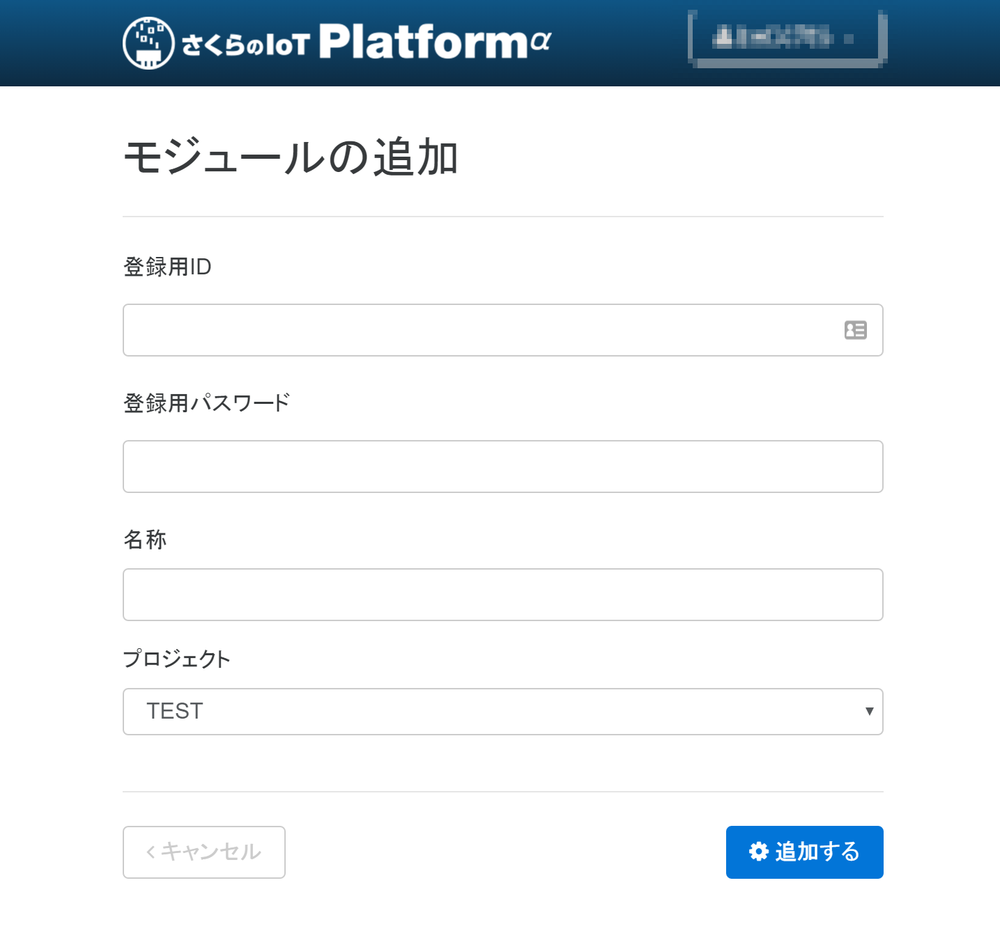

登録用ID/パスワードの欄に通信モジュール裏面に貼られたシールの情報を入力します。

下の画像中、赤枠で囲った部分にIDとパスワードが記載されています。

もし字が小さすぎる等で情報が読み取れない場合は、青枠で囲った部分の2次元バーコードをスマートフォンアプリ等で読むと `ID  /  PASS` のような形式で情報を読み出すことができます。

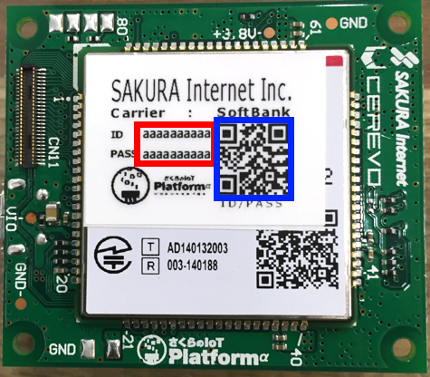

モジュール名と登録先プロジェクトを適切に設定したら、『追加する』をクリックしてプロジェクトにモジュールを追加します。

続いて、『+サービス追加』をクリックして連携サービスを追加します。


追加したいサービスをクリックします。ここではWebSocketを選択します。

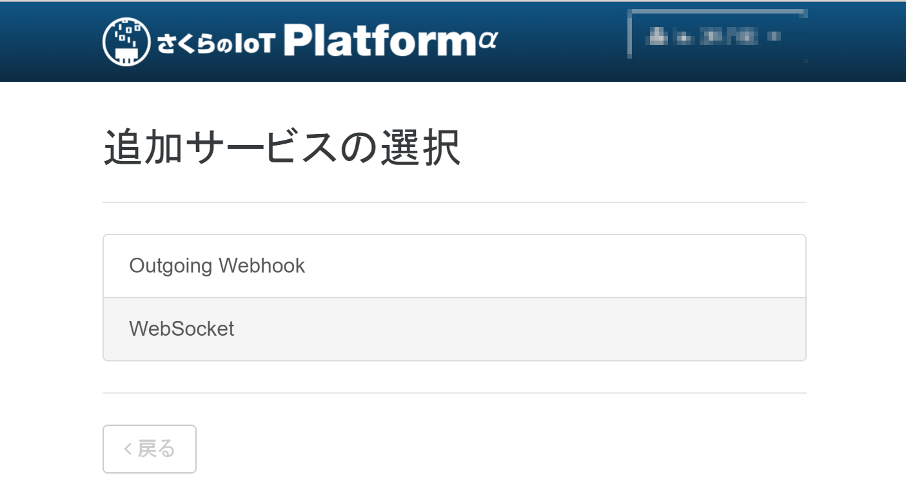

サービス連携名を入力し、『作成する』をクリックします。

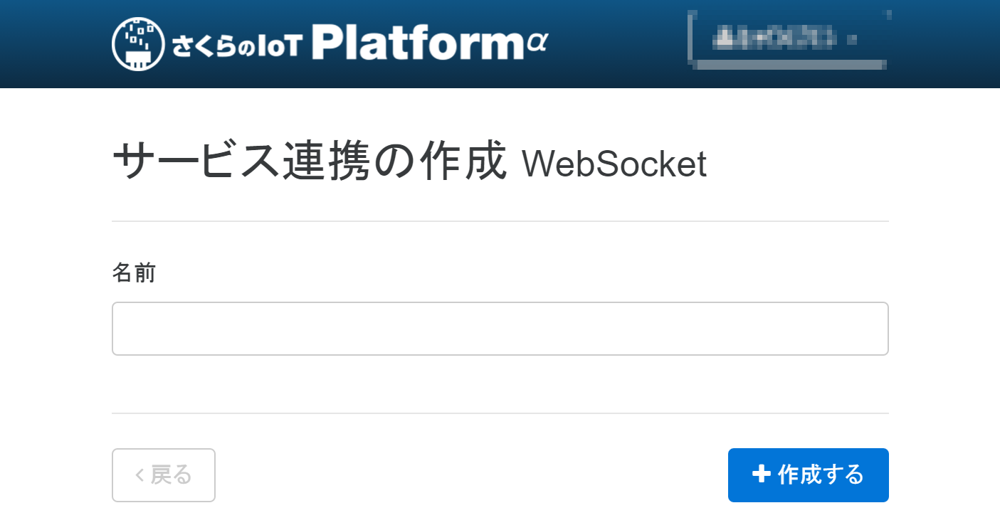

これでWebSocketサービスとの連携が完了しました。一旦『戻る』をクリックしてコントロールパネルに戻ります。

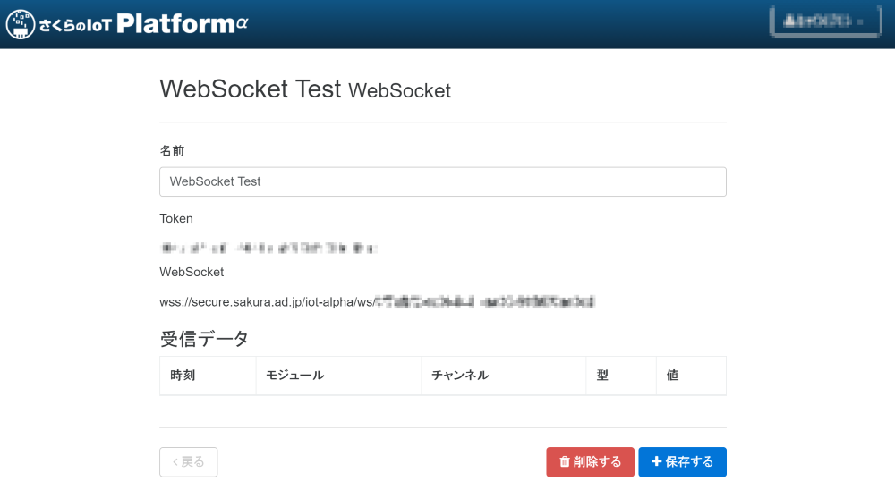

これでプラットフォームへのモジュール登録が完了しました。この状態でモジュールの電源を入れることでプラットフォームへモジュールが自動的に接続されます。

### 3. 通信モジュールの起動

添付されているケーブルをモジュールに接続し、12ピン（ケーブル色: 赤）に5V電源、11ピン（ケーブル色: 黒）をGNDに接続することで電源を投入することが出来ます。

4.B コネクタについてに記載されている通り ***通信モジュールの基板間コネクタが大変脆弱*** ですので、外部インターフェースコネクタにケーブルを抜き差しする際は十分注意してください。

下図中、赤丸で示したあたりに親指を当て、しっかり押さえてケーブルを抜き差しすることをおすすめします。

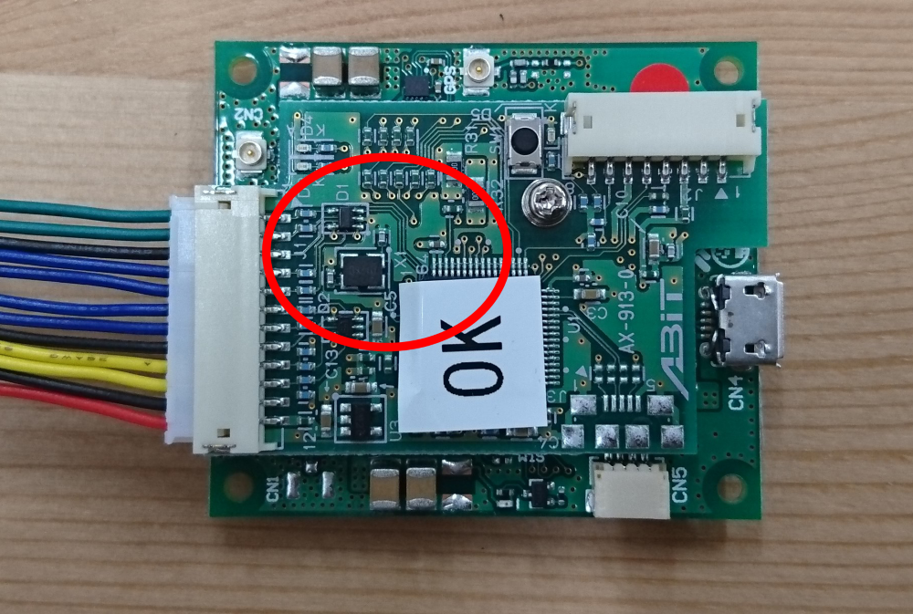

なお、初回起動時には自動でファームウェアアップデートが実行されるため、起動に時間が掛かります。途中で電源を切るなどしても自動で再開するため問題はありませんが、電源を入れたまま5分程度放置してください。

アップデートが完了し、モジュールが起動すると接続ステータスが「オンライン」になります（2016/06/03現在、自動でのステータス取得が行われないため30秒おきにページをリロードする等の対応をお願いします）。

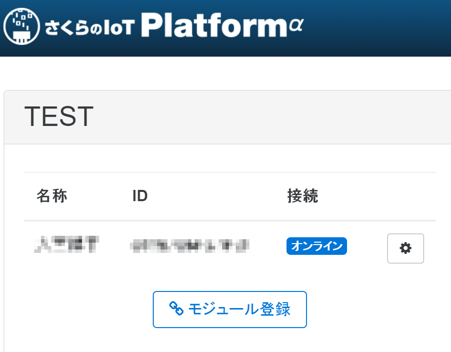

### 4. 通信モジュールからのデータ送信

#### A. Arduinoを利用する場合
市販のマイコンボード、Arduinoを使用して動作確認する場合の手順です。

Arduinoを購入し、[Arduino IDE](https://www.arduino.cc/en/Main/Software)をインストールしたら、さくらの通信モジュール専用のArduino向けライブラリを以下のページからダウンロードします。

https://github.com/sakura-internet/SakuraAlphaArduino

アクセスしたら、『Clone or download』（図中①で示すボタン）をクリックし、出てきたポップアップ内『Download ZIP』（図中②で示すボタン）をクリックして、ライブラリをダウンロードします。

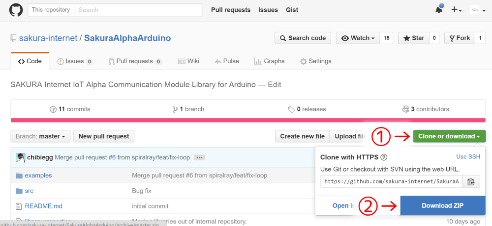

ダウンロードし、ライブラリを開いたらArduinoのライブラリ格納フォルダに `SakuraAlphaArduino-master` フォルダごとコピーします。


ライブラリをコピーしたらArduino IDEを起動し、サンプルコードを開きます。

Arduino IDEのメニューバーから『ファイル』→『スケッチの例』→『SakuraAlpha』→『SakuraAlpha_I2C』を選択してください。

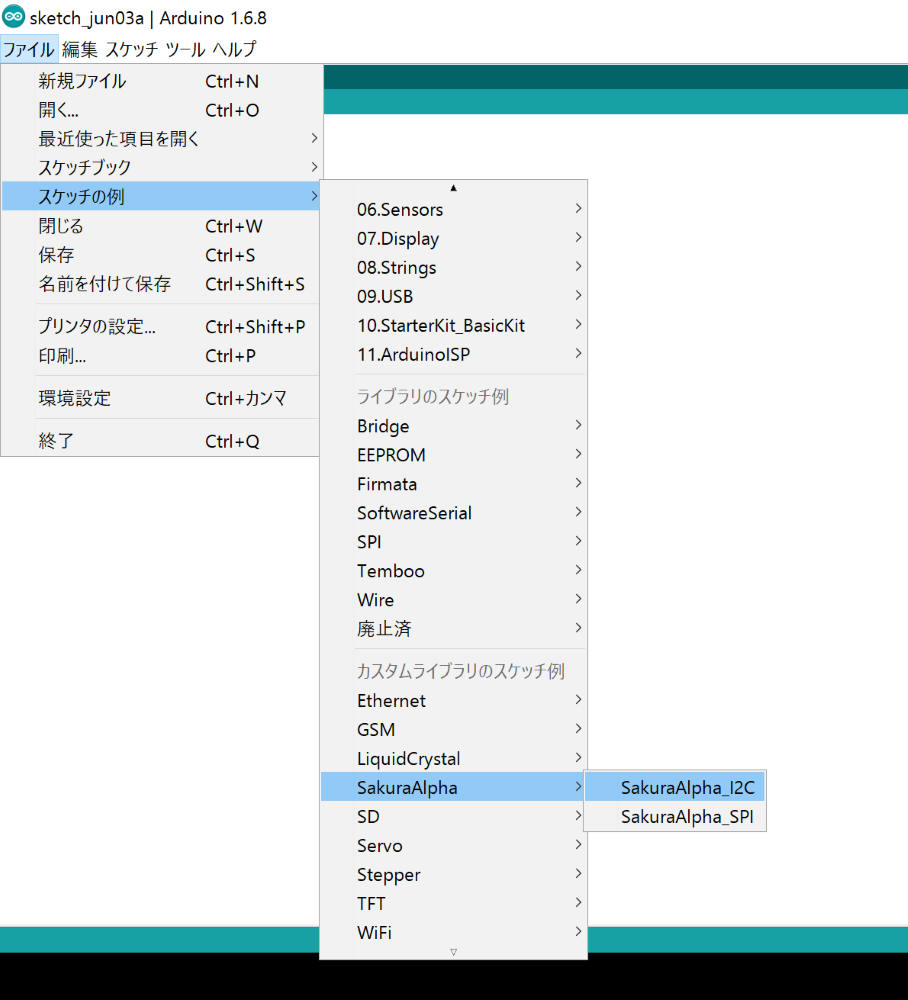

IDEにサンプルが読み込まれました。配線が間違っていなければこのままで動きますので、『ツール』→『シリアルポート』と辿りArduinoのシリアルポートを選択してから(複数選択肢が出た場合は `Arduino/Genuino Uno` と表示されている物を選択してください)、図中赤丸で示した→マークのボタンでプログラムをArduinoに書き込みます。

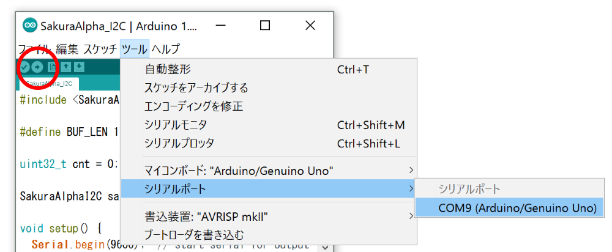


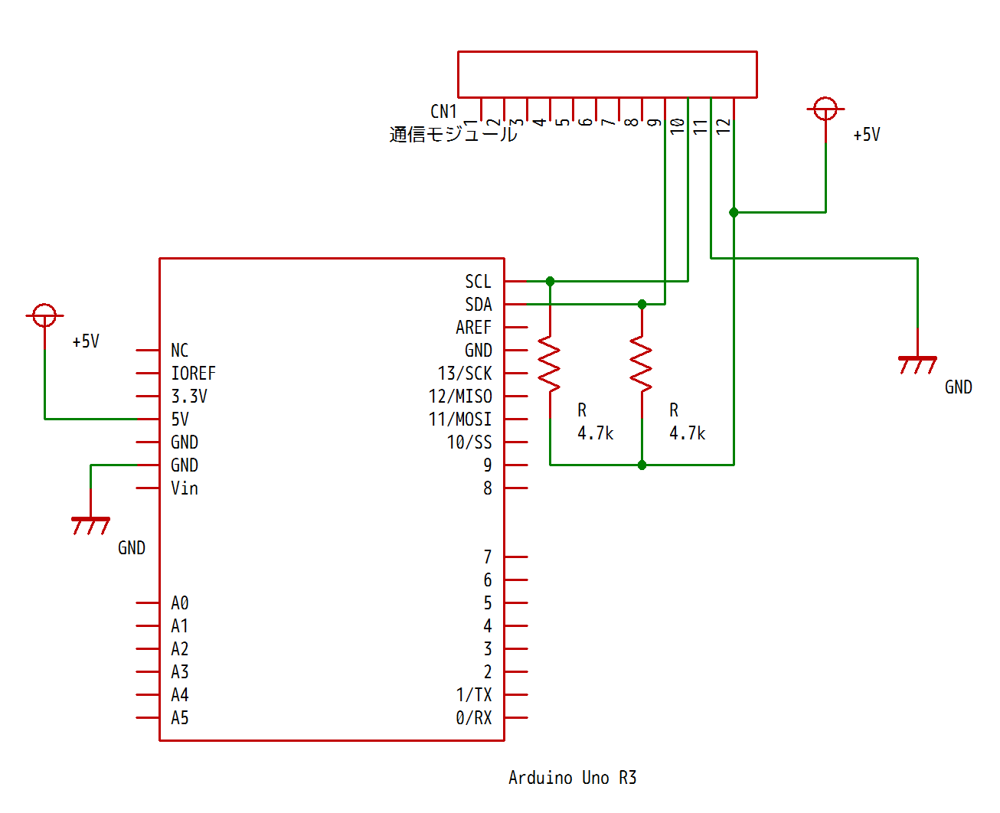


#### B. USBシリアル変換器を使う場合
USBシリアル変換器を用いて動作確認を行う場合の手順です。

TTL-232R-3V3で動作確認をしています。その他のUSBシリアル変換器を使用する際は必ずシリアル側が3.3Vの品を利用してください。


配線が完了したら、TeraTerm等のソフトウェアを用いてUSBシリアル変換器のシリアルポートに接続します。接続する際は以下のパラメータを使用してください。


| 項目名 | 値 |
|:-----|:---|
| ボーレート | 115200 bps |
| データ長 | 8 bit |
| パリティ | なし |
| ストップビット | 1 bit |
| フロー制御 | なし |


既にモジュールを起動している場合はシリアルポートを開いたままリセットボタンを押してください。以下のような表示が出てくるまで待ちます。

```
Sakura IoT Alpha (201505xxxxxx-xxxxxxxx)
>
```

[シリアルコマンドリファレンス](module/shell.md) を参考に `settx` コマンドを利用するとデータが送信できます。
